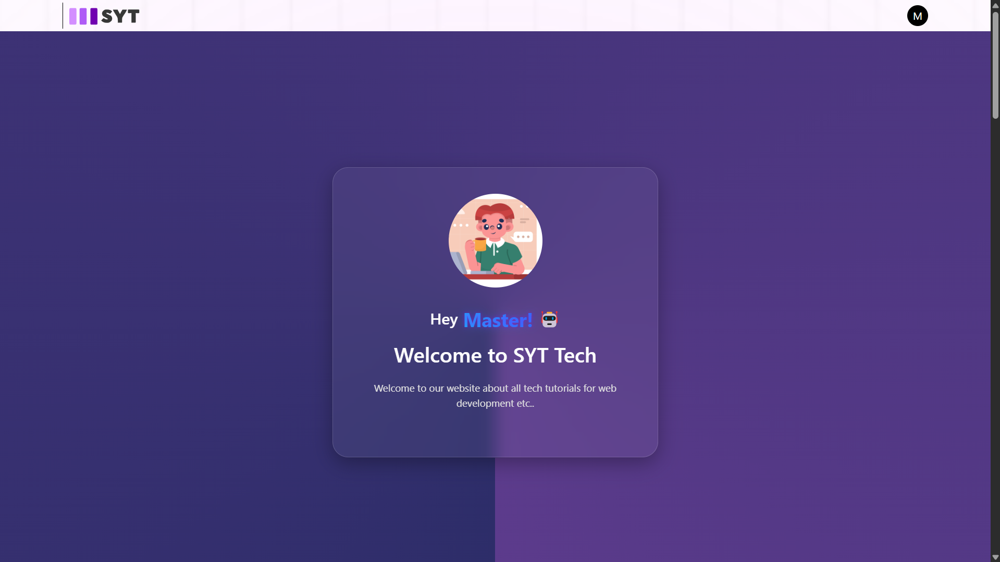

# 🚀 SERN Stack Powerhouse App!

Welcome to the ultimate **SERN stack** web app built with **SQLite**, **Express JS**, **React**, and **Node JS**! This app brings together powerful tech to deliver a seamless user experience with a **Login**, **Register**, and **Table** feature, plus awesome functionalities like password reset, OTP verification, and CRUD operations for the admin. Let’s dive into the features! 🔥

---

## 🔑 Features

### **Login** – You're In!  
- Log in using these **super simple** credentials to access the app:
  - **Username:** ```admin@gmail.com```
  - **Password:** ```1```
- Get started instantly and explore all the features!

### **Register** – Join the Team!  
- Ready to sign up? Register quickly by entering your **email**, **password**, and **username**.

### **Forgot Password?** – No Worries!  
- Forgot your password? No problem! Click on the **Forgot Password** link, and we’ll send you an **OTP** to reset it!

### **OTP Verification** – Stay Secure!  
- **Reset Password OTP**: Get an OTP sent straight to your inbox to secure your account!
- **Account Verification OTP**: New users get a verification OTP to activate their account!

### **Table** – Admin Power!  
- The **admin** can perform **CRUD (Create, Read, Update, Delete)** operations on the user table! 👑
- You can also **verify** new users and manage their accounts efficiently!

---

## ⚡ How to Use the App?

1. **Login**:  
   - Hit the **Login** page and use the username and password provided above to get in.
   
2. **Register**:  
   - Want in? Go to the **Register** page, sign up with your details, and you're ready to go!

3. **Forgot Password**:  
   - Just click **Forgot Password** and we'll send you a **Reset OTP** to get your account back in action!

4. **OTP Verification**:  
   - Receive an OTP in your email to **verify your account** and make sure your account is secure.

5. **Admin Mode**:  
   - **Admins** can easily perform CRUD operations and **verify** users in the table. Take control like a pro! 👑

---

## 💻 Tech Stack

- **SQLite**: A super lightweight database to store all your critical user data.
- **Express JS**: The heart of the backend – handling requests, responses, and server-side magic.
- **React**: The futuristic frontend framework that brings your UI to life!
- **Node JS**: The power behind the server, making it all run smoothly.

---

---

## 🚀 Installation Guide

Ready to get started? Simply open the URL below to access the web:

<a href="https://login-register-form-2vad.onrender.com/login" style="font-size: 24px; color: #A722FF; font-weight: 900; text-decoration: none;">SERN Auth</a>

<p style="font-size: 14px; color: #FFFFFF;">
  Deployed on 
  <a href="https://render.com/" style="font-size: 15px; color: #FF1CF0; font-weight: 900; text-decoration: none;">
    Render.com
  </a>
</p>


---


## 🔑 Admin Credentials

- **Username**: ``` admin@gmail.com ```
- **Password**: ``` 1 ```

Now, go ahead and **unlock** the full power of this app! 🚀

---

Feel free to reach out if you have any questions or need help! Let's get building! 💪

# 📷 Snapshots 
  ## **Login** 


## **Sign Up** 


## **Home** 



## **Verify User** 


## **Forgot Password** 


## **Table** 


---
